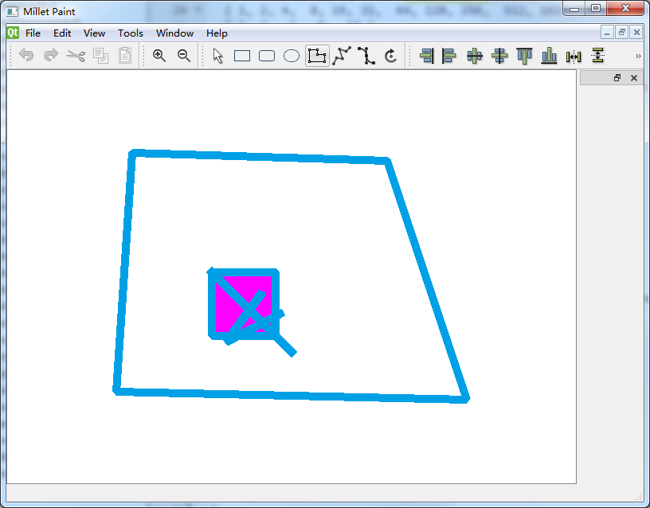

# MilletPaint

## 基础知识简介

### QGraphicsView

#### 简介

在Qt界面库中，对于图形的绘制，可以使用 `QPainter` 实现普通二维图形的绘制，该方法在 `paintEvent` 事件里编写绘图程序，其本质绘制的图形是位图，这种方法更适合于绘制复杂度不高的固定图形，并且不能实现图项的选择、编辑、拖放、修改等交互功能。

对于需要绘制大量的、需要交互的图形，可使用Graphics View绘图架构，它是一种基于图形项（`Graphics Item`）的模型/视图模式，这种方式可以在一个场景中绘制大量图元项，且每个图元项都是可选择、可交互的。

从`QT4.2`开始引入了`Graphics View`框架用来取代`QT3`中的`Canvas`模块，并作出了改进，`Graphics View`框架实现了模型－视图结构的图形管理，能对大量图元进行管理，支持碰撞检测，坐标变换和图元组等多种方便的功能。

`QPainter`采用面向过程的描述方式绘图；`GraphicsView`采用面向对象的描述方式绘图。对于复杂的图像来说，如果图像包含大量的直线、曲线、多边形等图元对象，管理图元对象比管理`QPainter`的绘制过程语句要容易，并且图元对象更符合面向对象的思想，图形的可复用性。

#### 框架

在`Graphics View`绘图架构中，主要涉及到下面三个类的使用：

**场景类（`QGraphicsScene`）**：该类提供绘图场景（`Scene`），场景是不可见的，是一个抽象的管理图形项的容器，可向场景中添加图形项，获取场景中的某个图形项等，主要功能如下：

* 提供管理大量图元的快速接口；
* 传播事件到场景中的每个图元；
* 提供未经变换的渲染功能，主要用于打印；
* 管理图元状态，如图元选择和焦点处理；

**视图类（`QGraphicsView`）：**该类提供绘图的视图（`View`）组件，用于显示场景中的内容。可以为一个场景设置几个视图，用于对同一个数据集提供不同的观察方式；

**图形项类（`QGraphicsItem`）：**该类提供了一些基本的图形元件，也可在此基础上自定义图形项，它支持各种事件的响应，如鼠标事件、键盘事件、拖放事件等，以实现图形的交互功能，下面列举一些标准图元：

`QGraphicsEllipseItem` 椭圆
`QGraphicsLineItem` 直线
`QGraphicsPathItem` 路径
`QGraphicsPixmapItem` 图像
`QGraphicsPolygonItem` 多边形
`QGraphicsRectItem` 矩形
`QGraphicsSimpleTextItem` 简单文本
`QGraphicsTextItem` 文本浏览
`QGraphicsItem`是图元的基类，用户可以继承`QGraphicsItem`实现自定义的图元；

#### 坐标系

`Graphics View`基于笛卡尔坐标系。item在场景中的位置与几何形状通过x,y坐标来表示。当使用未经变形的视图来观察场景时，场景中的一个单位等于屏幕上的一个像素。在`Graphics View`绘图架构中涉及到了3个坐标系，即场景坐标、视图坐标及图形项坐标。

**场景坐标：**对应`QPainter`的逻辑坐标，以场景的中心为原点，X轴正方向向右，Y轴正方向向下；


**视图坐标：**即窗口界面的物理坐标，单位是像素，其左上角为原点坐标，所有鼠标事件、拖拽事件最开始都使用视图坐标，为了和图元交互，需要转换坐标为场景坐标；
**图形项坐标：**图元存在于自己的本地坐标上，通常以图元的中心为原点，图元中心也是所有坐标变换的原点，图元坐标方向是X轴正方向向右，Y轴正方向向下（同上图）。

#### 示例

~~~c++
// 定义一个场景
QGraphicsScene scene;   

// 定义一个矩形图元
QGraphicsRectItem *m_rectItem = new QGraphicsRectItem();  
m_rectItem->setRect(0, 0, 80, 80);
m_rectItem->setPen(pen);
m_rectItem->setBrush(QBrush(QColor(255, 0, 255)));
m_rectItem->setFlag(QGraphicsItem::ItemIsMovable);

// 定义一个多边形图元
QGraphicsPolygonItem *m_polygonItem = new QGraphicsPolygonItem();   
QPolygonF polygon;
polygon << QPointF(-100.0, -150.0) << QPointF(-120.0, 150.0)
            << QPointF(320.0, 160.0) << QPointF(220.0, -140.0);
m_polygonItem->setPolygon(polygon);
m_polygonItem->setPen(pen);
m_polygonItem->setFlag(QGraphicsItem::ItemIsMovable);

// 添加到场景中
scene.addItem(m_rectItem);      

// 定义一个视图，并把场景添加到视图
QGraphicsView view(&scene); 
view.resize(1024, 768);
view.show();
~~~

主要流程就是：将 `Item`加入到`scence`，然后将 `scence`添加到 `view`中，并显示。

`Item`：就是图形    `Scence`：就是画板    `View`：就是窗口

### 资源文件


## 主窗口



### menubar

~~~c++
void MainWindow::CreateAction()
{
    m_pFileNew = new QAction("&New", this);
    m_pFileNew->setShortcut(QKeySequence::New);					// 快捷键
    m_pFileNew->setStatusTip("Create a new file");				// tips
    connect(m_pFileNew, SIGNAL(triggered()), this, SLOT(New()));
    
    // View
    m_pViewZoomIn = new QAction("&Zoom In", this);
    m_pViewZoomIn->setIcon(QIcon(":icons/zoomin.png"));			// icon

}
void MainWindow::CreateMenuBar()
{
    CreateAction();
    
    QMenu * pMenu = nullptr;
    // File
    pMenu = new QMenu("&File", this);
    pMenu->addAction(m_pFileNew);
    pMenu->addAction(m_pFileOpen);
    pMenu->addAction(m_pFileSave);
    pMenu->addSeparator();
    pMenu->addAction(m_pFileQuit);
    ui->menubar->addMenu(pMenu);
}
~~~


### toolbar

~~~c++
void MainWindow::CreateToolBar()
{
    m_pEditToolBar = addToolBar("Edit");
    m_pEditToolBar->setIconSize(QSize(24, 24));
    m_pEditToolBar->addAction(m_pEditUndo);
    m_pEditToolBar->addAction(m_pEditRedo);
    m_pEditToolBar->addAction(m_pEditCut);
    m_pEditToolBar->addAction(m_pEditCopy);
    m_pEditToolBar->addAction(m_pEditPaste);

    m_pEditToolBar->addAction(m_pViewZoomIn);
    m_pEditToolBar->addAction(m_pViewZoomOut);
}
    
~~~


### QDockWidget

`QDockWidget`类提供了一个特殊的窗口部件，它可以是被锁在`QMainWindow`窗口内部或者是作为顶级窗口悬浮在桌面上。
`QDockWidget`类提供了`dock widget`的概念，`dock widget`也就是我们熟悉的工具面板或者是工具窗口。`Dock window`是放置在
`QMindow`窗口周围的`dock widget`区域中的。


 Dock windows可以在几个区域中移动，或者是悬浮。该类提供的`API`允许程序员限制`dock widgets`的移动，悬浮和关闭，以及它
可以被放置的区域。 

【外观】
一个`QDockWidget`包含一个小的工具栏和内容区域。小的工具栏用于显示窗口标题，一个浮动按钮和一个关闭按钮。取决于`QDockWidget`的状态，浮动按钮和关闭按钮可能或者禁止或者完全不显示。

工具栏和按钮的显示取决于你所使用的样式。

`QDockWidget`可以作为它子窗口部件的封装，通过`setWidget()`设置子窗口部件。自定义的尺寸提示，最小和最大化尺寸已经尺寸策略都必须由子窗口部件来实现。`QDockWidget`会遵守它们，调整它自己的限制包括框架和工具栏。我们不应该为`QDockWidget`设置尺寸限制，因为它们根据`QDockWidget`是否锁住而改变，一个锁住的`QDockWidget`窗口部件不包括框架和小的工具栏。

~~~c++
QDockWidget *dock = new QDockWidget(this);
addDockWidget(Qt::RightDockWidgetArea, dock);
~~~

### Central widget

设置中心显示区域

~~~c++
QMdiArea *m_pMdiArea;
setCentralWidget(m_pMdiArea);
~~~


### QMdiArea 

` QMdiArea` 一般使用于主窗口`QMainWindow`，用于容纳多个子窗口`QMdiSubWindow `


~~~c++
    m_pMdiArea = new QMdiArea(this);
    m_pMdiArea->setHorizontalScrollBarPolicy(Qt::ScrollBarAsNeeded);
    m_pMdiArea->setVerticalScrollBarPolicy(Qt::ScrollBarAsNeeded);
    setCentralWidget(m_pMdiArea);
~~~

## 子窗口

### 绘图窗口

`DrawView` 


用于显示的视图，继承自 `QGraphicsView`, `Mdi` 窗口的子窗口。`DrawView` 界面含有两个 标尺杆，一个横向，一个纵向，中间是一个 场景视图 `sences`。

* `QtRuleBar * m_pHRuleBar;`

* `QtRuleBar * m_pVRuleBar;`    
* `DrawScene * sence`

主要属性：

> 一个横向标尺，一个纵向标尺，文件路径等。。。

主要功能：

> 缩放，载入文件，保存文件。。。


#### 标尺

`QtRuleBar`


这里继承 `QWidget`，把它也看成是 `View`的一个子窗口（初始化的时候将`DrawView` 作为父类指针传入），只是位置在最上边，和最右边，需要 `move` 一下

主要属性：

>横纵向（Orientation），起点（Lower），终点（Upper），最大值（Max），位置（Point）。。。

主要功能：

> 鼠标移动时候，标尺中显示鼠标位置。。。

#### 场景

`DrawScene`


场景 `DrawScene`，继承`QGraphicsScene`，是操作，绘制， `Item`的地方。

主要属性：

> 网格，位置

主要功能

> `Item`的移动，旋转等操作


## 类的实现

### `DrawView`

这一个是窗口显示的类，所以，可以增加一些前台操作后台处理的逻辑，比如，前台打开文件对话框，选择文件，后台载入文件。

* 缩放

  >`QGraphicsView ` 提供接口 `void scale(qreal sx, qreal sy)` 对当前的 `View` 进行缩放
  >
  >```c++
  >void zoomIn(); { this->scale(); }
  >void zoomOut();{ this->scale(); }
  >```

* 新建文件

  > 新建一个窗口的时候，需要对它进行命名，所以当前视图可以存一个私有的 `QString m_strCurFile` 作为窗口名。
  >
  > ~~~c++
  > void NewFile();{ this->setWindowTitle(m_strCurFile + "[*]");}
  > ~~~

* 保存文件

  > 将当前场景中所有的图元进行保存，这里可以区分一下是保存还是另存为，另存为就需要另外选择名字保存。所以，这里为了和打开的文件进行区分，可以增加一个变量表示是否已经有名字了， `m_bIsUntitled`。如果没名字，保存的时候，就需要用户输入，如果有，则可以直接保存。
  >
  > ~~~c++
  > void Save();{ foreach (QGraphicsItem *item , scene()->items()) { /* ... */ }}; 
  > void SaveAs();{ foreach (QGraphicsItem *item , scene()->items()) { /* ... */ }}; 
  > void SaveFile(const QString strName) {}
  > ~~~

* 载入文件

  > 打开已经存储过的文件，
  >
  > ~~~c++
  > void Load(const QString strName){ QFile file; file.open(); /*...*/ };
  > ~~~

* 判定当前场景中的图元是否被修改过

  > 对于未修改的，可以直接保存或者不保存，对于修改过的，则需要提示，当然也可以，在窗体中增加一个 '*'表示有修改，就像 notepad++那样。
  >
  > ~~~c++
  >  void setModified( bool value ) { modified = value ; }
  > ~~~

* 当前窗口关闭的时候（重写事件）

  `void closeEvent(QCloseEvent *event) Q_DECL_OVERRIDE;`

  > 关闭的时候，是需要提示是否保存的
  >
  > ~~~c++
  > void closeEvent(QCloseEvent *event) Q_DECL_OVERRIDE { MaybeSave() ? event->accept() : event->ignore(); }
  > ~~~

* 当鼠标移动的时候（重写事件）

  `void mouseMoveEvent(QMouseEvent * event) Q_DECL_OVERRIDE;`
  
  > 鼠标移动的时候，需要提示栏显示坐标信息，需要标尺上显示鼠标的横纵位置。
  >
  > 鼠标移动事件默认触发为点击鼠标左键的时候才触发，所以，要移动就触发需要构造函数中调用`setMouseTracking(true);`
  >
  > * 显示坐标信息：因为坐标信息的显示是在主窗口的状态栏（`statusbar`）中，所以需要子窗口（`View`）发送信号给主窗口（`MainWindow`），所以，需要定义一个信号。当坐标变化的时候，发送消息。
  >
  > ~~~c++
  > // DrawView.h 
  > signals:
  > void positionChanged(int x , int y );
  > // DrawView.cpp
  > void DrawView::mouseMoveEvent(QMouseEvent *event)
  > {
  > 	QPointF pt =mapToScene(event->pos());
  > 	emit positionChanged( pt.x() , pt.y() );
  > 	QGraphicsView::mouseMoveEvent(event);
  > }
  > 
  > // MainWindow.h
  > public slots:
  > void positionChanged(int x, int y );
  > // MainWindow.cpp
  > void MainWindow::positionChanged(int x, int y)
  > {
  > 	this->statusBar()->showMessage(QString("%1,%2").arg(x).arg(y));
  > }
  > 
  > // CreateMdiChild()
  > connect(view,SIGNAL(positionChanged(const int, const int)),this,SLOT(positionChanged(const int, const int)));
  > 
  > ~~~
  >
  > * 标尺的横纵坐标：在坐标变化的时候，给标尺传入坐标，更新重绘。
  >
  > ~~~c++
  > // DrawView.cpp
  > void DrawView::mouseMoveEvent(QMouseEvent *event)
  > {
  > 	m_pHRuleBar->updatePosition(event->pos());
  >     m_pVRuleBar->updatePosition(event->pos());
  > 	QGraphicsView::mouseMoveEvent(event);
  > }
  > ~~~
  >

* 调整大小的时候（重写事件）

  `void resizeEvent(QResizeEvent *event) Q_DECL_OVERRIDE;`

  >调整大小的时候，标尺需要跟着改变。
  >
  >~~~c++
  >void DrawView::resizeEvent(QResizeEvent *event)
  >{
  >    QGraphicsView::resizeEvent(event);
  >	// 重置标尺大小 横向为当前窗口宽 - 边界大小，高为：RULER_SIZE，
  >    m_pHRuleBar->resize(this->size().width()- RULER_SIZE - 1, RULER_SIZE);
  >    // 移动标尺到横坐标为 RULER_SIZE，纵坐标为 0 的位置
  >    m_pHRuleBar->move(RULER_SIZE, 0);
  >    m_pVRuleBar->resize(RULER_SIZE, this->size().height() - RULER_SIZE - 1);
  >    m_pVRuleBar->move(0, RULER_SIZE);
  >
  >    updateRuler();
  >}
  >~~~

* 重写滚动条的信息事件

  `void scrollContentsBy(int dx, int dy) Q_DECL_OVERRIDE;`

  >因为在手动拖动滚动条的时候，是需要修改标尺的值的，所以，需要重写这个事件，获取标尺的信息
  >
  >~~~c++
  >void DrawView::scrollContentsBy(int dx, int dy)
  >{
  >    QGraphicsView::scrollContentsBy(dx,dy);
  >    updateRuler();
  >}
  >~~~

* 更新滚动条

  `void updateRuler();`

  > 在放大或者缩小，或者滚动条值变化的时候，都是需要重新修改滚动条值或者标尺的。
  >
  > ~~~c++
  > void DrawView::updateRuler()
  > {
  >  if ( scene() == 0) return;
  > 
  >  // 获取当前窗体大小
  >  QRectF viewbox = this->rect();
  > 
  >  // 将场景左上角的值转换到视图左上角的值
  >  QPointF offset = mapFromScene( scene()->sceneRect().topLeft() );
  > 
  >  // 获取横向缩放的值
  >  // Returns the horizontal scaling factor.
  >  double factor =  1.0 / transform().m11();
  > 
  >  // 最小值 = 缩放比例 * (视口左边值 - 偏移的原点值)
  >  double lower_x = factor * ( viewbox.left()  - offset.x() );
  >  // 最小值 = 缩放比例 * (视口右边边值 - 标尺宽度 - 偏移的原点值)
  >  double upper_x = factor * ( viewbox.right() - RULER_SIZE - offset.x());
  > 
  >  // 设置横向的范围
  >  m_pHRuleBar->SetRange(lower_x, upper_x, upper_x - lower_x );
  >  // 更新重绘
  >  m_pHRuleBar->update();
  > 
  >  // 纵向，左下角为 原点 因为   
  >  double lower_y = factor * ( viewbox.top() - offset.y()) * -1;
  >  double upper_y = factor * ( viewbox.bottom() - RULER_SIZE - offset.y() ) * -1;
  > 
  >  m_pVRuleBar->SetRange(lower_y,upper_y,upper_y - lower_y );
  >  m_pVRuleBar->update();
  > 
  >  //qDebug()<<viewbox<<QPoint(lower_x,upper_x) << QPoint(lower_y,upper_y) << offset;
  > }
  > ~~~


#### .h


~~~c++
#ifndef DRAWVIEW_H
#define DRAWVIEW_H

#include <QGraphicsView>
#include "qtrulebar.h"

class DrawView : public QGraphicsView
{
    Q_OBJECT

public:
    DrawView(QGraphicsScene *scene);

    // 缩放功能
    // void scale(qreal sx, qreal sy)
    void zoomIn();
    void zoomOut();

    void NewFile();
    bool MaybeSave();

    bool Save();
    bool SaveAs();
    bool SaveFile(const QString &fileName);
    bool Load();

    QString UserFriendlyCurrentFile();
    QString StrippedName(const QString &fullFileName);
signals:
    void PositionChanged(const int x ,const int y );
protected:
    void closeEvent(QCloseEvent *event) Q_DECL_OVERRIDE;
    void mouseMoveEvent(QMouseEvent * event) Q_DECL_OVERRIDE;
    void resizeEvent(QResizeEvent *event) Q_DECL_OVERRIDE;
    void scrollContentsBy(int dx, int dy) Q_DECL_OVERRIDE;

protected:
    void updateRuler();

protected:
    QtRuleBar * m_pHRuleBar;
    QtRuleBar * m_pVRuleBar;

    QString m_strCurFile;
    bool m_bIsUntitled;
    bool m_bModified;
};

#endif // DRAWVIEW_H
~~~

#### .cpp

```c++
#include "drawview.h"

DrawView::DrawView(QGraphicsScene *scene)
   : QGraphicsView(scene)
{
    setViewport(new QWidget);
    setAttribute(Qt::WA_DeleteOnClose);

    //这是激活整个窗体的鼠标追踪， 默认需要按下鼠标左键才能激活 mouseMoveEvent
    setMouseTracking(true);

    // 窗体的刻度尺
    // 这里第三个参数一定要传入，因为是在本界面上显示绘制
    m_pHRuleBar = new QtRuleBar(Qt::Horizontal, this, this);
    m_pVRuleBar = new QtRuleBar(Qt::Vertical, this, this);

    // 设置边距，标尺的宽高
    setViewportMargins(RULER_SIZE-1,RULER_SIZE-1,0,0);

    NewFile();
}

void DrawView::zoomIn()
{
    scale(1.2, 1.2);
    updateRuler();
}

void DrawView::zoomOut()
{
    scale(1 / 1.2, 1 / 1.2);
    updateRuler();
}

void DrawView::NewFile()
{
    static int sequenceNumber = 1;

    m_bIsUntitled = true;
    m_bModified = true;
    m_strCurFile = tr("Paint-%1.xml").arg(sequenceNumber++);
    setWindowTitle(m_strCurFile + "[*]");
}

bool DrawView::MaybeSave()
{
    if (m_bModified)
    {
        QMessageBox::StandardButton ret;
        ret = QMessageBox::warning(this, tr("MDI"),
                                   tr("'%1' has been modified.\n"
                                      "Do you want to save your changes?")
                                       .arg(UserFriendlyCurrentFile()),
                                   QMessageBox::Save | QMessageBox::Discard | QMessageBox::Cancel);
        if (ret == QMessageBox::Save)
            return Save();
        else if (ret == QMessageBox::Cancel)
            return false;
    }

    return true;
}

bool DrawView::Save()
{
    return m_bIsUntitled ? SaveAs() : SaveFile(m_strCurFile);
}

bool DrawView::SaveAs()
{
    QString fileName = QFileDialog::getSaveFileName(this, tr("Save As"), m_strCurFile);
    if (fileName.isEmpty())
        return false;

    return SaveFile(fileName);
}

bool DrawView::SaveFile(const QString &fileName)
{

}

bool DrawView::Load()
{

}

QString DrawView::StrippedName(const QString &fullFileName)
{
    return QFileInfo(fullFileName).fileName();

}

QString DrawView::UserFriendlyCurrentFile()
{
    return StrippedName(m_strCurFile);
}

void DrawView::closeEvent(QCloseEvent *event)
{
    MaybeSave() ? event->accept() : event->ignore();
}

void DrawView::mouseMoveEvent(QMouseEvent *event)
{
    QPointF pt =mapToScene(event->pos());
    m_pHRuleBar->updatePosition(event->pos());
    m_pVRuleBar->updatePosition(event->pos());
    emit PositionChanged( pt.x() , pt.y() );
    QGraphicsView::mouseMoveEvent(event);
}

void DrawView::resizeEvent(QResizeEvent *event)
{
    QGraphicsView::resizeEvent(event);

    m_pHRuleBar->resize(this->size().width()- RULER_SIZE - 1,RULER_SIZE);
    m_pHRuleBar->move(RULER_SIZE, 0);
    m_pVRuleBar->resize(RULER_SIZE, this->size().height() - RULER_SIZE - 1);
    m_pVRuleBar->move(0, RULER_SIZE);

    updateRuler();
}

void DrawView::scrollContentsBy(int dx, int dy)
{
    QGraphicsView::scrollContentsBy(dx,dy);
    updateRuler();
}

void DrawView::updateRuler()
{
    if ( scene() == 0) return;

    // 获取当前窗体大小
    QRectF viewbox = this->rect();

    // 将场景左上角的值转换到视图左上角的值
    QPointF offset = mapFromScene( scene()->sceneRect().topLeft() );

    // 获取横向缩放的值
    // Returns the horizontal scaling factor.
    double factor =  1.0 / transform().m11();

    // 最小值 = 缩放比例 * (视口左边值 - 偏移的原点值)
    double lower_x = factor * ( viewbox.left()  - offset.x() );
    // 最小值 = 缩放比例 * (视口右边边值 - 标尺宽度 - 偏移的原点值)
    double upper_x = factor * ( viewbox.right() - RULER_SIZE - offset.x());

    // 设置横向的范围
    m_pHRuleBar->SetRange(lower_x, upper_x, upper_x - lower_x );
    // 更新重绘
    m_pHRuleBar->update();

    double lower_y = factor * ( viewbox.top() - offset.y()) * -1;
    double upper_y = factor * ( viewbox.bottom() - RULER_SIZE - offset.y() ) * -1;

    m_pVRuleBar->SetRange(lower_y, upper_y, upper_y - lower_y );
    m_pVRuleBar->update();
}

```


### `DrawScene`

场景类，是绘制图元的地方，场景是不可见的，是一个抽象的管理图形项的容器，可向场景中添加图形项，获取场景中的某个图形项等，主要功能如下：

> 提供管理大量图元的快速接口；传播事件到场景中的每个图元；提供未经变换的渲染功能，主要用于打印；管理图元状态，如图元选择和焦点处理；

此类继承自 `QGraphicsScene`

* 绘制背景事件（重写事件）

  `void drawBackground(QPainter *painter, const QRectF &rect) Q_DECL_OVERRIDE;`

  这里的绘制应该是分两部分，一部分是重新绘制背景（视口的背景色），而部分就是前景（场景的背景色和网格）

  ~~~c++
  //.h
  GridTool * m_pGrid; //一个用来绘制背景网格的工具类
  // cpp
  void DrawScene::drawBackground(QPainter *painter, const QRectF &rect)
  {
      if(m_pGrid == nullptr)
          m_pGrid = new GridTool();
  
      // 绘制背景，这时候是绘制整个窗口
      QGraphicsScene::drawBackground(painter,rect);
  
      // 绘制场景部分的大小
      painter->fillRect(sceneRect(),Qt::white);
  
      // 绘制错误
      //m_pGrid->paintGrid(painter, rect);
  
      m_pGrid->paintGrid(painter, sceneRect());
  }
  ~~~

* 


## 设计想法

### 绘制部分

1、因为每次只能绘制一个图形，所以，可以增加一个绘制工具类（DrawTool），里面放一些**静态的**参数表示图形信息，比如：当前绘制的图形，当前按下的点。。。

2、其余的图形的绘制和操作可以继承自当前的这个绘制工具类，比如，选中的时候，移动会显示图形边框。。。

~~~c++
class DrawTool
{
public:
    static DrawShape c_drawShape;
};
class SelectTool : public DrawTool
{
public:
    SelectTool();
    virtual void mousePressEvent(QGraphicsSceneMouseEvent * event , DrawScene * scene ) ;
    virtual void mouseMoveEvent(QGraphicsSceneMouseEvent * event , DrawScene * scene ) ;
    virtual void mouseReleaseEvent(QGraphicsSceneMouseEvent * event , DrawScene * scene );
    QPointF initialPositions;
    QPointF opposite_;
    QGraphicsPathItem * dashRect;
    GraphicsItemGroup * selLayer;
};
~~~


## 接口

### `CreateMdiChild()`

> 功能：创建一个子窗体
>
> 流程：创建一个场景，创建一个视图，将场景加入视图中，并且设置视图的左下角为（0，0）。在将这个视图加入到 `Mdi` 的子窗体中，最后最大化显示。
>
> 注意：此处的场景必须给大小，要不然不会有正常显示的图像。

~~~c++
DrawView *MainWindow::CreateMdiChild()
{
    DrawScene *scene = new DrawScene(this);
    QRectF rc = this->rect();
    scene->setSceneRect(rc);
    scene->setBackgroundBrush(Qt::darkGray);

    DrawView *view = new DrawView(scene);

    // move orign point to leftbottom
    view->setTransform(view->transform().scale(1,-1));

    scene->setView(view);
    m_pMdiArea->addSubWindow(view);

    view->showMaximized();
    return view;
}
~~~


## 编写中遇到的问题

### 多一个窗口


在最右边始终有一个窗口（严格说应该是 toolbar，因为他可以像 toolbar 一样移动），看名字，又是主窗口的名字。所以在 `MainWindow` 构造里面找到，这是因为设置了 dock 窗体。

主要理解这个图

​                                                  


### 移动 `Item`时产生的错误


会在背景图上，绘制错误。因为背景图是在 场景中绘制的，所以去找场景中的接口。


因为，场景绘制背景图，`rect `并非场景视图的位置和大小，所以，可以用下面一个场景的位置，这样肯定是位置不会错的。

### 坐标系错误

绘制时候，屏幕的左上角为原点（0，0）


原因：

在更新 标尺 最大最小值的时候。在纵向采用的应该是左下角为原点。而在标尺中，采用的是左上角为原点`lower`。所以。这里在设置的时候，应该直接设置，而非去判断大小一次。

~~~c++
void DrawView::updateRuler()
{
    double lower_y = factor * ( viewbox.top() - offset.y()) * -1;
    double upper_y = factor * ( viewbox.bottom() - RULER_SIZE - offset.y() ) * -1;

    m_pVRuleBar->SetRange(lower_y, upper_y, upper_y - lower_y );
    m_pVRuleBar->update();
}

void QtRuleBar::SetRange(const int nLower, const int nUpper, const int nMax)
{
    // 错误
//    m_nLower = nLower < nUpper ? nLower : nUpper;
//    m_nUpper = nLower > nUpper ? nLower : nUpper;
//    m_nMax = nMax < m_nUpper? m_nUpper : nMax;

    m_nLower = nLower;
    m_nUpper = nUpper;
    m_nMax = nMax;
}
~~~

